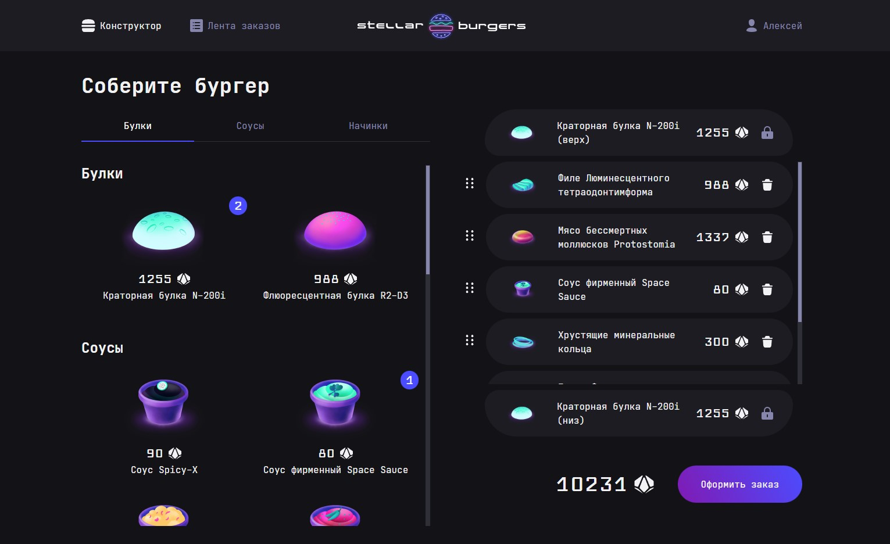

# Веб-приложение "Космическая бургерная"

[](https://github.com/cap-Bernardito/space-burger/actions/workflows/lint.yml?query=branch%3Amain)

Учебный проект, разработанный в рамках курса "React-разработчик".
Позволяет пользователю собирать космический бургер с помощью конструктора.
Работает на ПК и мобильных устройствах.

[Ссылка на приложение](https://cap-bernardito.github.io/space-burger)

[](https://cap-bernardito.github.io/space-burger)

## Использованные технологии:

- React
- Redux
- React Router
- WebSockets
- JSON Web Tokens
- Jest
- Cypress
- GitHub Actions

## Доступные команды

```bash
// Установка зависимостей
$ npm install

// Запуск проекта в режиме разработки
$ npm run start

// Запуск проекта в режиме разработки с фейковыми данными
$ npm run start:fd

// Сборка проекта в папку `build`
$ npm run build

// Запуск jest тестов
$ npm run test

// Запуск cypress тестов с просмотром в браузере
$ npm run start
// Затем в другом терминале
$ npm run cypress:open

// Запуск cypress тестов в headless режиме
$ npm run start
// Затем в другом терминале
$ npm run cypress:run
```
